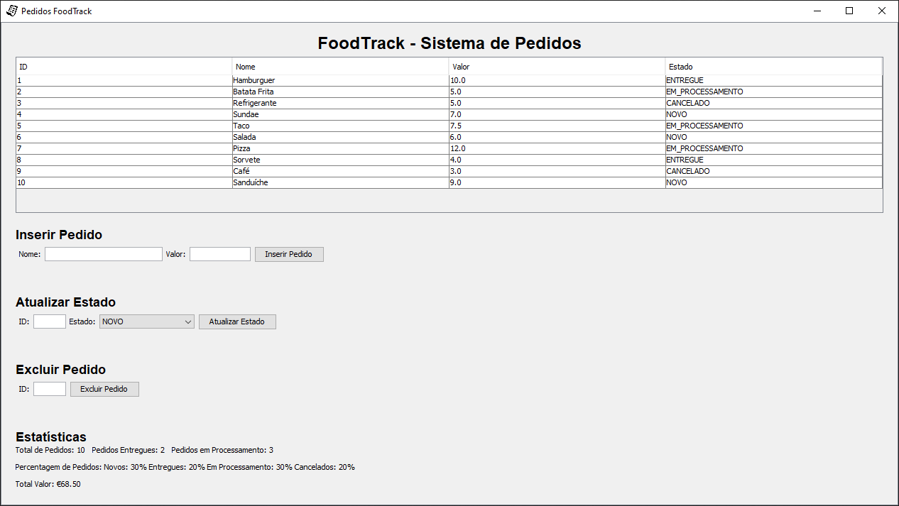

# FoodTrack

Este projeto é uma simulação de um sistema de pedidos para uma rede de fast food. Ele foi desenvolvido como parte do curso de Programação Orientada a Objetos.

## Funcionalidades

- Gerenciamento de pedidos
- Cálculo de preços
- Listagem de itens do menu
- Atualização de status dos pedidos
- Exclusão de pedidos
- Exibição de estatísticas dos pedidos

## Tecnologias Utilizadas

- Java
- Swing para a interface gráfica
- Enumerações (Enums)

## Como Executar

1. Clone o repositório.
2. Importe o projeto em sua IDE de preferência.
3. Compile e execute a classe principal `Main`.

## Estrutura do Projeto

```plaintext
📁 FoodTrack/
├── 📂 src/
│   ├── 📂 assets/             # Contém os recursos do projeto, como imagens
│   ├── Main.java              # Classe principal que inicializa o projeto
│   ├── Interface.java         # Classe responsável pela interface gráfica
│   ├── ControllerPedido.java  # Classe que gerencia os pedidos
│   ├── Pedido.java            # Classe que representa um pedido
│   ├── EstadoPedido.java      # Enumeração que representa os estados de um pedido
│   └── DataInitializer.java   # Classe responsável por inicializar dados fictícios
├── README.md                  # Documentação do projeto
```

## Preview


